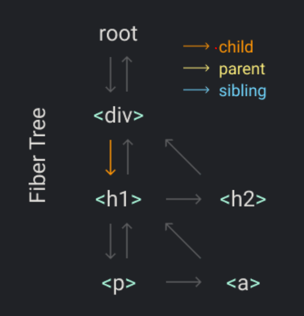

# Simple Virtual DOM

[build your own react](https://pomb.us/build-your-own-react/) 글을 참고하여, 리액트 및 V-DOM을 클론하면서 정리한 레포입니다.

## ✅ 체크 리스트

-   [x] JSX 코드를 React.createElement 함수를 통해 element 객체 생성한다.
-   [x] React.render 함수를 통해 Real DOM을 변경한다.
-   [x] 렌더링 과정의 작업 단위를 분리했다.
-   [x] 렌더링 과정의 작업 단위를 fiber로 변환했다.
-   [ ] 상태 변경이 일어난 노드 부터 diffing이 시작된다.
-   [ ] V-DOM의 동작 원리를 이해한다.
-   [ ] V-DOM 비교를 통해 Real DOM을 변경한다.
-   [ ] Typescript로 마이그레이션을 완료했다.

## 🚴‍♀️ Log

## 0. Bottom up

아래의 3줄의 코드가 어떻게 JavaScript 코드로 변환 될지 고민해보자.

```js
const element = <h1 title="foo">Hello</h1>;
const container = document.getElementById('root');
ReactDOM.render(element, container);
```

## 1. JSX는 JavaScript 코드가 아니다.

JSX 코드를 Babel로 트랜스파일링하면 `React.createElement` 함수로 변경된다.

```js
// JSX
<div> Hello World </div>;

// JS
React.createElement('div', null, ' Hello World ');
```

-   계층적인 엘리먼트는 아래와 같이 트랜스파일링 된다.

```js
// JSX
<div>
    <h1 id="title">a</div>
    <h2>Hello World</h2>
</div>;

// JS
React.createElement(
    "div",
    null,
    React.createElement("h1", { id: "title"}, "a"),
    React.createElement("h2", null, "Hello World")
)
```

## 2. React.createElement은 객체를 반환한다.

-   `React.createElement` 함수의 결과값은 객체이다.

```js
// JSX
<div></div>;

// React.createElement("div")
const result = {
    type: 'div',
    props: { children: [] },
};
```

-   props의 children 배열의 값이 원시값(숫자, 문자열 등)인 경우에는 `text node` 타입으로 변환된다.

```js
//JSX
<div>Hello World</div>;

// React.createElement('div', null, 'Hello World');
const result = {
    type: 'div',
    props: {
        children: [
            {
                type: 'TEXT_NODE',
                props: {
                    nodeValue: 'Hello World',
                },
            },
        ],
    },
};
```

-   만약, children 배열의 값이 원시값이 아닌 경우에는 재귀적으로 Element 객체를 생성한다.

```js
// JSX
<div>
    <h1 id="title">Hello World</h1>
</div>;

// React.createElement(
//    'div',
//     null,
//     React.createElement("h1", { id: "title"}, "a")
//  )

const result = {
    type: 'div',
    props: {
        type: 'h1',
        children: [
            {
                type: 'TEXT_NODE',
                props: {
                    nodeValue: 'Hello World',
                },
            },
        ],
    },
};
```

## 3. ReactDOM.render

## 1. render 함수를 구현하기 전..

createElement 함수를 통해 JSX가 JavaScript 객체로 변환되는 것을 알게 되었다.  
다시, 처음의 코드로 돌아가보자.

```js
// 중첩된 객체
const element = <h1 title="foo">Hello</h1>;
// HTMLElement
const container = document.getElementById('root');

// TODO
ReactDOM.render(element, container);
```

결국, element 변수는 객체, container 변수는 HTMLElement를 담고 있다.  
이제 우리가 해결해야 할 것은 HTMLElement에 element 객체를 통해 어떻게 Element Node를 삽입할 지 결정하는 것이다.

## 2. render 함수를 구현해보자.

render 함수의 인자 값은 element, container이다. 간단히 render 함수를 구현하면 아래와 같다.

```js
function render(element, $container) {
    const dom = document.createElement(element.type);

    $container.appendChild(dom);
}
```

element 객체는 **재귀적**으로 중첩되어 있는 객체이다. 반복문을 통해 중첩된 부모-자식 구조를 반영해주자.

```js
function render(element, $container) {
    const dom = document.createElement(element.type);

    element.props.children.forEach(child => render(child, dom));

    $container.appendChild(dom);
}
```

자식 노드의 타입이 text node인 경우와, 노드의 속성을 추가적으로 반영해보자.

```js
function render(element, $container) {
    const dom =
        element.type == 'TEXT_ELEMENT' // 엘리먼트 타입이 텍스트 노드 여부에 따라 분기
            ? document.createTextNode('')
            : document.createElement(element.type);

    // 속성 반영
    Object.keys(element.props)
        .filter(prop => prop !== 'children') // children prop은 자식 element 배열
        .forEach(prop => ($dom[prop] = element.props[prop]));

    element.props.children.forEach(child => render(child, dom));
    $container.appendChild(dom);
}
```

## 4. 동시성 모드

## 1. 재귀 호출의 문제점

현재 render 함수는 재귀적으로 호출되어 DOM을 구성하고 있다.  
만약, DOM 트리가 깊다면 렌더링 시간이 오래 걸리게 되고, 사용자는 렌더링 동안 아무것도 하지 못하게 된다.

```js
const render = ({ type, props }, $container) => {
    // recursive
    props.children.forEach(child => render(child, $dom));
    // ..
};
```

## 2. 재귀 호출을 개선해보자.

우선, 작업을 작은 단위(unit)로 나눠보자.  
작업을 작은 단위로 나누게 되면, 작업을 완료 후 조건에 따라 렌더링을 멈추고 우선순위가 높은 작업을 처리할 수 있다.

```js
let nextUnitOfWork = null;

const performUnitOfWork = nextUnitOfWork => {
    // TODO
};

const workLoop = deadline => {
    // 우선순위가 높은 작업처리를 위한 flag
    let shouldYield = false;

    while (nextUnitOfWork && !shouldYield) {
        nextUnitOfWork = performUnitOfWork(nextUnitOfWork);
        shouldYield = deadline.timeRemaining() < 1;
    }
    requestIdleCallback(workLoop);
};
```

## 5. Fiber(Fiber Tree)

## 1. Fiber Tree

작업을 작은 단위로 나누었다. 이제, 이 작업을 처리하기 위한 Fiber Tree 자료구조를 공부해보자.  
Fiber Tree에서 Fiber은 작업 단위(unit)을 처리를 위한 단위 의미한다.

예시를 통해 확인해보자.

```js
Didact.render(
    <div>
        <h1>
            <p />
            <a />
        </h1>
        <h2 />
    </div>,
    container,
);
```

위 엘리먼트 구조에서 렌더링 작업의 순서는 다음과 같다. 결국은 엘리먼트들을 fiber로 만들어 트리 구조를 만드는 목적은 특정 작업 단위를 처리하고 다음 처리해야 할작업을 쉽게 찾기 위함이다.

1. start
2. process `div` fiber
    1. process `h1` fiber
        1. process `p` fiber
        2. process `a` fiber
    2. process `h2` fiber
3. end

  
(그런데, 자식이 부모를 참조하고 있으니 트리가 아니라 그래프 아닌가???)

위의 그림을 통해 fiber의 우선 순위는 다음과 같다.

1. 자기 자신(self)
2. 자기 자식 fiber (child)
3. 형제 fiber (sibling)

우선 순위를 통해, 렌더링 과정을 추상화해보자.

1. 자기 자신의 작업을 완료한다.
2. 자식 fiber가 있다면, 자식 fiber을 다음 작업으로 선택한다.
3. 형제 fiber가 있다면, 형제 fiber를 다음 작업으로 선택한다.
4. 작업을 종료 후 부모 fiber로 돌아간다.
5. 만약 부모 fiber가 root라면 렌더링을 종료한다.

✅ **각 fiber은 실행 시 1번 과정 부터 수행된다.**

## Ref

-   [build-your-own-react](https://pomb.us/build-your-own-react/)
-   [build-your-own-react 번역 글](https://velog.io/@godori/build-your-own-react)
-   [gyeongseokseo 님의 virtual-dom slideshare](https://www.slideshare.net/gyeongseokseo/virtual-dom)
-   [Babel repl](https://babeljs.io/repl)
